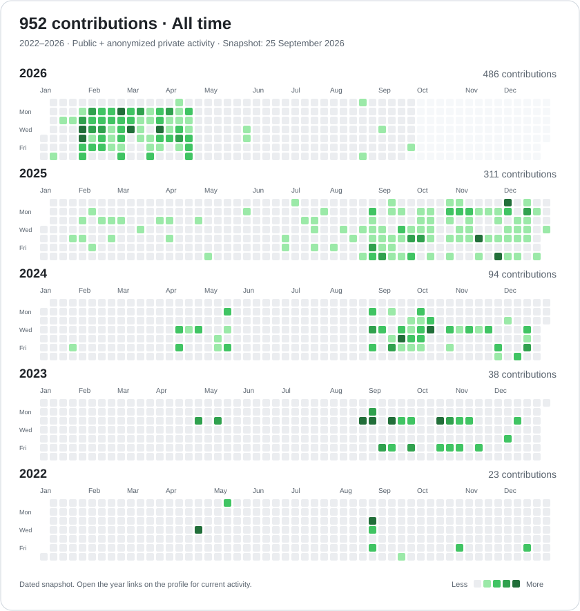

# Harold Tcheuko Wouassi

**Full-stack & mobile developer · Montréal, Canada · Français / English**

I build web applications with **Angular, React and ASP.NET Core**, and mobile applications with **Flutter**. My work spans product development, client websites and community platforms.

I am pursuing a **Bachelor's degree in Computer Science and Software Engineering at UQAM**, after completing a DEC in Computer Science Technology at Cégep Édouard-Montpetit.

[Portfolio](https://harold.click) · [LinkedIn](https://www.linkedin.com/in/haroldtch/) · Open to software development opportunities in Greater Montréal

## Selected projects

| Project | Highlights | Explore |
| --- | --- | --- |
| **Nid de poule** | Flutter road-hazard reporting prototype with photos, geolocation, Firebase and Mapbox. | [Source & setup](https://github.com/roldhaa/niddepoule) |
| **Super Cartes Infinies** | Angular / ASP.NET Core multiplayer card game with SignalR, JWT authentication and asynchronous matchmaking. | [Project overview](https://github.com/roldhaa/Super-Cartes-Infinies-demo) |
| **Post Hub** | Angular / ASP.NET Core forum platform with SQL Server, hierarchical roles, media management and Swagger documentation. | [Project overview](https://github.com/roldhaa/Posthub-demo) |
| **Tail'ed** | Contributions to job filters, dynamic result counts and location normalization. React, TypeScript and Firebase. | [Dashboard](https://github.com/tailed-community/dashboard) |

*Super Cartes Infinies and Post Hub are public project presentations; application source code and runnable demos are not currently included in those repositories.*

## Experience

- **Spryto · Software development · 2024-present:** mobile product development with Flutter and Firebase, including authentication, video streaming and Team of the Week features.
- **Krunch Marketing · Web development · October 2025-present:** responsive client websites and landing pages built from Figma designs in collaboration with design and marketing teams.
- **Tail'ed · Software development internship · March-May 2026:** web features and technical testing with React, shadcn/ui, Tailwind CSS, Node.js, Express and Firebase.
- **TD Bank Group · Bilingual customer support · June 2026-present:** French and English support for EasyLine banking services and digital platforms.

## Contributions you can review

- [Job filters and dynamic counts](https://github.com/tailed-community/dashboard/pull/76): multiple state selections, dependent city filters and clearer location handling.
- [Canada / California filtering fix](https://github.com/tailed-community/dashboard/pull/74): normalize locations and remove ambiguity in the displayed country names.
- [Internship location normalization](https://github.com/tailed-community/tech-internships-2025-2026/pull/2): improve geographic data used by the job board.

## Technology stack

| Area | Technologies |
| --- | --- |
| Frontend | Angular, React, TypeScript, JavaScript, Tailwind CSS, shadcn/ui |
| Mobile | Flutter, Dart, Android, iOS |
| Backend | C#, ASP.NET Core, Node.js, Express, REST APIs, SignalR |
| Data & cloud | Firebase, SQL Server, PostgreSQL, Entity Framework Core, Azure |
| Tools | Git, GitHub, Azure DevOps, Docker, Figma, Postman |
| Practices | Object-oriented programming, MVC, MVVM, Clean Architecture, Agile/Scrum |

## Recognition

- **OSEntreprendre Challenge 2025:** national finalist in the university category with Spryto.
- **ApplÉTS Mobile Challenge 2025:** recipient of an ÉTS student scholarship; delivered a mobile application during a 24-hour hackathon.

## En français

Développeur web et mobile bilingue, diplômé en techniques de l'informatique au Cégep Édouard-Montpetit et étudiant au baccalauréat à l'UQAM. Mes projets combinent Angular, React, ASP.NET Core et Flutter, avec un intérêt pour les applications temps réel et les produits mobiles.

Je suis ouvert aux opportunités en développement logiciel dans le Grand Montréal. [Échangeons sur LinkedIn](https://www.linkedin.com/in/haroldtch/).

## All-time contributions

**952 contributions recorded across 2022–2026.** Public activity and anonymized private contributions.

| Year | Contributions |
| --- | ---: |
| [2026](https://github.com/roldhaa?tab=overview&from=2026-09-01&to=2026-09-25) | 486 |
| [2025](https://github.com/roldhaa?tab=overview&from=2025-12-01&to=2025-12-31) | 311 |
| [2024](https://github.com/roldhaa?tab=overview&from=2024-12-01&to=2024-12-31) | 94 |
| [2023](https://github.com/roldhaa?tab=overview&from=2023-12-01&to=2023-12-31) | 38 |
| [2022](https://github.com/roldhaa?tab=overview&from=2022-12-01&to=2022-12-31) | 23 |
| **Total** | **952** |

*Snapshot: 25 September 2026. This overview does not update automatically. Follow the year links for current counts. These are all years available on this GitHub profile.*

